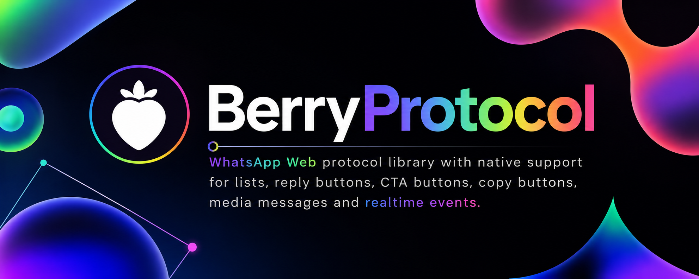

<p align="center">
  
</p>

<h1 align="center">BerryProtocol</h1>

<p align="center">
  SDK nativa de mensagens interativas do WhatsApp para TypeScript.
</p>

<p align="center">
  Crie experiências modernas no WhatsApp com listas nativas, botões,
  carrosséis, fluxos OTP, eventos em tempo real e automação multi-sessão.
</p>

<p align="center">
  <a href="https://www.npmjs.com/package/berryprotocol">
    
  </a>

  <a href="https://www.npmjs.com/package/berryprotocol">
    
  </a>

  <a href="https://github.com/BerrySDK/BerryProtocol">
    
  </a>

  

  

  
</p>

---

# Por que BerryProtocol

BerryProtocol é uma SDK moderna focada em desenvolvedores, criada para construir experiências avançadas no WhatsApp usando TypeScript.

Ao invés de focar apenas nos detalhes internos do protocolo, o BerryProtocol prioriza:

- mensagens interativas
- comunicação em tempo real
- escalabilidade multi-sessão
- experiência do desenvolvedor
- fluxos de automação
- integração simples via npm

O projeto faz parte do ecossistema BerrySDK e impulsiona fluxos modernos de automação no WhatsApp com uma API simples e escalável.

---

# Funcionalidades

## Mensagens Interativas Nativas

BerryProtocol possui suporte nativo para:

- Listas
- Botões de Resposta
- Botões CTA
- Botões de Copiar
- Mensagens OTP
- Carrosséis
- Enquetes
- Reações
- Presence
- Mídia Rica
- Eventos em Tempo Real

---

## Arquitetura Multi-Sessão

Projetado para aplicações escaláveis.

- Múltiplas sessões do WhatsApp
- Estados de autenticação independentes
- Autenticação via QR Code
- Fluxos de código de pareamento
- Recuperação de sessão
- Reconexão automática

Perfeito para:

- plataformas SaaS
- sistemas de automação
- ferramentas de suporte
- plataformas de chatbot
- integrações com WhatsApp
- serviços de API

---

## Experiência do Desenvolvedor

BerryProtocol foi desenvolvido para ser simples, moderno e pronto para produção.

## Destaques

- API TypeScript-first
- Pacote ESM-first
- exports públicos organizados
- módulos agrupados da SDK
- eventos fortemente tipados
- integração leve
- distribuição via npm

---

# Instalação

```bash
npm install berryprotocol
````

---

# Início Rápido

```ts
import BerryProtocol, { makeLogger } from "berryprotocol";

const client = new BerryProtocol({
  sessionId: "default",
  logger: makeLogger(),
  reconnectDelayMs: 1500,
  reconnectMaxAttempts: 12,
  printQrInTerminal: true,
});

client.on("auth.qr", ({ value }) => {
  console.log("qr", value);
});

client.on("connection.open", () => {
  console.log("connected");
});

client.on("message.received", (message) => {
  console.log("incoming", {
    from: message.from,
    type: message.type,
  });
});

await client.connectWithQr();
```

---

# Exemplos de Mensagens Interativas

## Botões de Resposta

```ts
await client.sendButtons(chatId, {
  text: "Escolha uma opção",
  buttons: [
    {
      id: "buy",
      text: "Comprar agora",
    },
    {
      id: "support",
      text: "Suporte",
    },
  ],
});
```

---

## Listas

```ts
await client.sendList(chatId, {
  title: "Menu",
  buttonText: "Abrir",
  sections: [
    {
      title: "Pizzas",
      rows: [
        {
          id: "calabresa",
          title: "Pizza Calabresa",
        },
      ],
    },
  ],
});
```

---

## Botões de Copiar

```ts
await client.sendCopyButton(chatId, {
  text: "Seu código de verificação",
  code: "458921",
});
```

---

## Mensagens em Carrossel

```ts
await client.sendCarousel(chatId, {
  text: "Produtos em destaque",
  cards: [
    {
      title: "Berry Burger",
      body: "Hambúrguer especial",
      footer: "BerryProtocol",
    },
  ],
});
```

---

# Eventos em Tempo Real

BerryProtocol disponibiliza eventos tipados em tempo real para sistemas modernos de automação.

```ts
client.on("message.received", console.log);

client.on("message.updated", console.log);

client.on("message.reaction", console.log);

client.on("presence.update", console.log);

client.on("connection.update", console.log);
```

---

# Suporte a Mídia

Fluxos de mídia suportados:

* imagens
* vídeos
* áudio
* mensagens de voz
* figurinhas
* documentos
* GIFs

Exemplo:

```ts
await client.sendImage(chatId, {
  url: "./image.png",
  caption: "BerryProtocol",
});
```

---

# Ecossistema

BerryProtocol faz parte do ecossistema BerrySDK.

## Pacotes

* `berryprotocol`
* `berryotp`
* `berryapi`

## Ferramentas Futuras

* BerryStudio
* construtor visual de mensagens
* editor de fluxos em tempo real
* inspetor de webhooks
* designer de automações

---

# Estrutura do Repositório

```txt
src/
 ├── Auth/
 ├── Defaults/
 ├── Media/
 ├── Messages/
 ├── Socket/
 ├── Store/
 ├── Types/
 ├── Utils/
 └── index.ts
```

---

# Requisitos

* Node.js >= 20
* npm

---

# Scripts Úteis

```bash
npm run build
npm run clean
npm run prepublishOnly
```

---

# Versionamento

BerryProtocol utiliza versionamento semântico manual.

Fluxo recomendado para releases:

```bash
npm version patch
git push origin main --follow-tags
```

---

# Contribuindo

Antes de abrir um PR:

* execute `npm install`
* execute `npm run build`
* mantenha as typings estáveis
* evite quebrar exports públicos
* mantenha a documentação atualizada
* valide os fluxos de mensagens interativas

---

# Roadmap

* Native Flow Messages
* Formulários do WhatsApp
* Advanced Carousel Builder
* Melhor pipeline de mídia
* Helpers de IA embarcados
* Integração com BerryStudio
* Editor visual de fluxos
* Ferramentas de replay de webhook
* Dashboard de sessões

---

# Suporte

Se o BerryProtocol ajuda o seu projeto:

* dê uma estrela no repositório
* contribua com exemplos
* abra issues
* compartilhe integrações
* ajude a melhorar a documentação

---

# Aviso Legal

BerryProtocol é um projeto independente de engenharia voltado para interoperabilidade e automação.

Não possui afiliação nem é endossado pelo WhatsApp.

```
